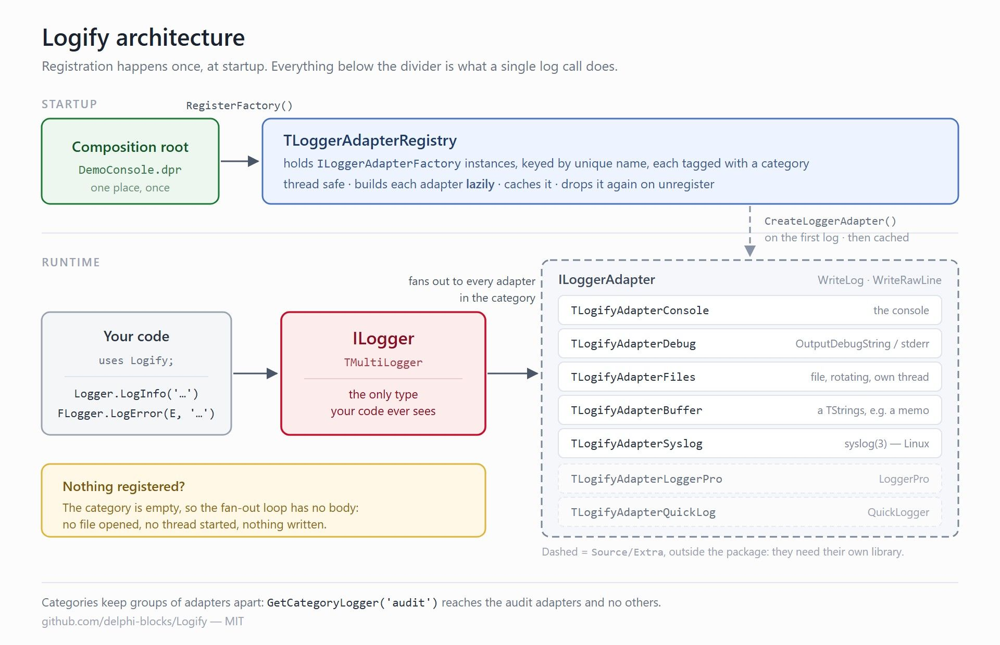

# Logify: meta-logger for Delphi 📝

<br />

<p align="center">
  
</p>

## Logify: what is it ❓

In modern software development, logging is indispensable for monitoring application health, debugging issues, and understanding user behavior. However, traditional logging approaches in Delphi often lead to tightly coupled code, where your application's business logic directly depends on a specific logging framework's classes and units. This creates a dependency, making it difficult to swap out loggers, introduces unnecessary compilation dependencies, and hinders testability. If you decide to change your logging backend to another solution, you're faced with a potentially large-scale refactoring effort across your entire codebase.

**Logify**, a new meta-logger for Delphi, is designed to liberate your applications from these rigid logging dependencies. Inspired by best practices seen in frameworks like .NET's `ILogger` interface, Logify's primary purpose is to provide a **simple, yet powerful, interface-based abstraction for logging**.

At its core, Logify introduces an `ILogger` interface that your application code will interact with exclusively. This means:

* **No Direct Logger Class Dependency:** Your business units will never directly reference `TMyLoggerSpecificClass` or `MyLoggerUnit.pas`. Instead, they'll simply "ask" for an `ILogger` instance.

* **True Decoupling:** The choice of the underlying logging implementation (e.g., writing to file, database, console, or a third-party logging library) is entirely handled by Logify's configuration and composition layer, completely outside your core application logic.

* **Enhanced Testability:** With an interface-based approach, you can easily mock or stub the `ILogger` interface during unit tests, ensuring that your tests focus purely on the business logic without generating actual log output or requiring a real logging setup.

* **Future-Proofing:** Should your logging requirements change, or a new, superior logging framework emerge, the transition becomes a matter of updating Logify's configuration and providing a new implementation of the `ILogger` interface, rather than modifying hundreds or thousands of lines of application code.

* **Cleaner Codebase:** By centralizing logging concerns behind an interface, your application code remains cleaner, more readable, and focused on its primary responsibilities.

Logify acts as an intelligent proxy or a "meta-logger," providing a unified front for various logging backends. It's about shifting the paradigm from "I use *this* logger" to "I need *a* logger," empowering Delphi developers to build more flexible, maintainable, and robust applications that are ready for evolution. This introduction will explore how Logify achieves this decoupling and how you can leverage its power to revolutionize your Delphi logging strategy.

## When to use Logify 📎

Logify is an easy interface to logging libraries so it makes sense to use it when you are in a situation where you already use more than a logger library, so you have to change your code one more time but... for the last time :-)

Logify is useful also when you use only one logger library because the reason (for me) that Logify was created is to have the possibility to compile some units with some logging in it in other project can may or may not have need for logging. So, actually, the main feature of Logify is not to log but to do absilutely nothing ;-)

Let me explain with a simple example:

```delphi

uses
  MyBeautifulLoggerUnit;

procedure TfrmMain.btnTestClick(Sender: TObject);
begin
  if CheckBox1.Checked then
  begin
    Edit1.Text := 'Paolo';
    // This is a fake line that emulates the API of a generic logger
    MyLogger.Log('Setting the value of Edit1', INFO); 
  end;
end;
```

you have code like that in a Form (or a DataModule, or a Unit) that generates lines in an already configured logfile and now you want to use this code in a new project but you don't need a logger right now (eventually you'll configure one)... what are your choiches?

1. Remove all the log lines 
2. IFDEF them
3. Configure the exact same logger (that you don't need)

as you can see all three options require quite some changes to the source code and you have to remember that this unit is shared back with another application!

So what Logify offers as a solution?

```delphi
uses
  Logify;

procedure TfrmMain.btnTestClick(Sender: TObject);
begin
  if CheckBox1.Checked then
  begin
    Edit1.Text := 'Paolo';
    // This is a simple call from the Logify interface
    Logger.LogInfo('Setting the value of Edit1');
  end;
end;
```

With Logify you can reuse this code as is it, without removing or modifying nothing. And later, if the need arise, you can configure properly the `Logger` object.

## Logify Architecture 🏛️

###  The `ILogger` Interface

The only thing your application code ever sees. It offers `Log` overloads plus one method per level, in three flavours: a plain message, a `Format` style message with arguments, and a message carrying an exception.

```delphi
Logger.LogInfo('a message');
Logger.LogInfo('the value is %d', [42]);
Logger.LogError(E, 'the operation failed');
Logger.LogRawLine('=== a banner ===', TLogLevel.Info);
```

`LogRawLine` asks the adapters to write the text as it is, with no timestamp, level or class decoration: handy for banners and separators.

The implementation behind it is a *multi logger*: a single call fans out to **every** adapter registered in its category. When no adapter is registered the loop has nothing to iterate and the call does nothing at all, which is the whole point of the library.

### The `ILoggerAdapter` Interface

What a logging backend implements. Two methods, mirroring the two ways a message can be written:

```delphi
procedure WriteLog(const AClassName, AMsg: string; AException: Exception; ALevel: TLogLevel);
procedure WriteRawLine(const AMsg: string; ALevel: TLogLevel);
```

An adapter is free to implement the interface directly, or to descend from `TLoggerAdapterHelper`, which already provides level filtering and a standard message layout. See [Writing your own adapter](#writing-your-own-adapter-).

### The `ILoggerAdapterFactory` Interface

Adapters are not registered directly: their factories are. `TLoggerAdapterRegistry` keeps the factories and builds each adapter lazily, the first time something actually logs to its category, then caches it. A factory is identified by `GetUniqueName`, which defaults to the class name and can be overridden by giving the factory a name.

This indirection is what keeps a configured file logger from opening files, spawning threads or touching the disk in a program that never logs.

Diagram for the Logify library architecture:

<p align="center">
  
</p>

## Log levels 🎚️

```delphi
TLogLevel = (Trace, Debug, Info, Warning, Error, Critical, Off);
```

The order is meaningful: an adapter configured at `Warning` drops everything below it. `Off` is never written by anybody.

## Getting a logger 🪝

The quickest way is the global `Logger` function, which logs to the `default` category:

```delphi
uses Logify;

Logger.LogInfo('Hello');
```

To have the originating class recorded in every line, ask `TLoggerManager` for a logger and keep it in a field:

```delphi
FLogger := TLoggerManager.GetLogger(Self.ClassType);   // by instance class
FLogger := TLoggerManager.GetLogger<TfrmMain>;         // by type
FLogger := TLoggerManager.GetLogger('TfrmMain');       // by name
```

### Categories

A category is an independent group of adapters. Register a factory under a category and ask for a logger bound to it: everything logged there reaches those adapters and no others.

```delphi
TLoggerAdapterRegistry.Instance.RegisterFactory('audit',
  TLogifyAdapterFilesFactory.CreateAdapterFactory('audit-file', AConfig));

FAudit := TLoggerManager.GetCategoryLogger<TfrmMain>('audit');
FAudit.LogInfo('user signed in');   // only the audit adapters see this
```

`GetCategoryLogger` comes in the same four shapes as `GetLogger`: bare, by `TClass`, by class name and generic. The category always comes first.

## Registering adapters 🔌

```delphi
// default category
TLoggerAdapterRegistry.Instance.RegisterFactory(
  TLogifyAdapterConsoleFactory.CreateAdapterFactory('console', TLogLevel.Info));

// a named category
TLoggerAdapterRegistry.Instance.RegisterFactory('audit', AFactory);
```

The registry can also be taken apart again, which matters for tests and for applications that reconfigure logging at runtime:

```delphi
TLoggerAdapterRegistry.Instance.UnregisterFactory('console');  // by name, or by factory
TLoggerAdapterRegistry.Instance.UnregisterCategory('audit');   // a whole category
TLoggerAdapterRegistry.Instance.Clear;                         // everything
```

Unregistering also drops the adapter cached for that factory, so registering the same name again builds a fresh one. Releasing an adapter runs its destructor, which is how a file logger stops its threads and a syslog adapter closes its session.

The registry is thread safe, and adapters are created exactly once however many threads race to log first.

## Bundled adapters 📦

| Adapter | Unit | Writes to |
| --- | --- | --- |
| Console | `Logify.Adapter.Console` | the console (allocating one on Windows if needed) |
| Debug | `Logify.Adapter.Debug` | `OutputDebugString` on Windows, `stderr` on POSIX |
| Files | `Logify.Adapter.Files` | a file, optionally rotating, written by a background thread |
| Buffer | `Logify.Adapter.Buffer` | a `TStrings` (a memo, a list box) or an internal buffer |
| Syslog | `Logify.Adapter.Syslog` | the local syslog daemon, on Linux |
| LoggerPro | `Source/Extra/Logify.Adapter.LoggerPro` | [LoggerPro](https://github.com/danieleteti/loggerpro) |
| QuickLogger | `Source/Extra/Logify.Adapter.QuickLogger` | [QuickLogger](https://github.com/exilon/QuickLogger) |
| DX.Logger | `Source/Extra/Logify.Adapter.DXLogger` | [DX.Logger](https://github.com/omonien/DX.Logger) and its providers (text file, Seq, UI) |

The adapters under `Source/Extra` are not part of the runtime package: they need their third party library on the search path, so add them to your project directly.

Adapters with more than a level to configure take an anonymous configuration method:

```delphi
TLoggerAdapterRegistry.Instance.RegisterFactory(
  TLogifyAdapterFilesFactory.CreateAdapterFactory('file',
    procedure(var AConfig: TFileLogConfig)
    begin
      AConfig.Level := TLogLevel.Debug;
      AConfig.SetLogName('myapp');
      AConfig.Path := './logs';
      AConfig.Ext := 'log';
    end
  ));
```

## The Syslog adapter 🐧

Logs through libc `syslog(3)`, so records go wherever the machine already sends them: `journald` under systemd, `rsyslog` otherwise, and on to a central collector if one is configured. Linux only; on other platforms the units compile to nothing, so a cross platform project can include them unconditionally.

> 📖 **[Docs/logify-syslog.md](Docs/logify-syslog.md)** is the full guide: every configuration property, the complete facility table, routing records to their own file with rsyslog, reading them back with `journalctl`, troubleshooting, and what the adapter does not do. What follows here is the short version.

```delphi
uses
  Logify, Logify.Syslog, Logify.Adapter.Syslog;

TLoggerAdapterRegistry.Instance.RegisterFactory(
  TLogifyAdapterSyslogFactory.CreateAdapterFactory('syslog',
    procedure (var AConfig: TSyslogConfig)
    begin
      AConfig.AppName := 'myapp';                    // the tag records are filed under
      AConfig.Facility := TSyslogFacility.Local6;    // local0..local7 are free for applications
      AConfig.Options := [TSyslogOption.PID];
      AConfig.Level := TLogLevel.Debug;
      AConfig.SplitLines := True;
    end
  ));
```

which lands in the journal as:

```
Aug 08 11:54:02 host myapp[1230]: [TfrmMain] INFO | user signed in
```

### Configuration

| Property | Default | Meaning |
| --- | --- | --- |
| `AppName` | `''` | The syslog tag. Empty means libc uses the program name |
| `Facility` | `User` | `Kernel`…`FTP`, plus `Local0`…`Local7` |
| `Options` | `[PID]` | `PID`, `Console`, `Delay`, `NoDelay`, `NoWait`, `PrintError` |
| `Level` | `Info` | Lowest level that reaches syslog at all |
| `SplitLines` | `True` | One syslog record per line of the message |
| `MaxLength` | `1024` | Longest record emitted; `0` removes the limit |
| `UseLogMask` | `False` | Also push `Level` down into libc via `setlogmask()` |

### How Logify levels map onto syslog

Syslog has eight severities, Logify six levels, so `Trace` and `Debug` share one severity. The level survives in the message text, so nothing is actually lost:

| `TLogLevel` | syslog severity | code |
| --- | --- | --- |
| `Trace` | `LOG_DEBUG` | 7 |
| `Debug` | `LOG_DEBUG` | 7 |
| `Info` | `LOG_INFO` | 6 |
| `Warning` | `LOG_WARNING` | 4 |
| `Error` | `LOG_ERR` | 3 |
| `Critical` | `LOG_CRIT` | 2 |
| `Off` | never emitted | |

The priority actually sent is `facility shl 3 or severity`, so `Local6` + `Error` is 179.

### Details worth knowing

* **The payload carries no timestamp.** Syslog records the time, the host, the tag and the pid itself; repeating any of it would only waste the line. What syslog cannot know is written instead: `[Class] LEVEL | message`.
* **Multi line messages become several records.** A logged exception, stack trace included, arrives as one readable record per line rather than a single blob with the newlines escaped to `#012`. Set `SplitLines := False` for one record per call instead.
* **`openlog()` and `closelog()` act on the process, not on a handle.** Several syslog adapters would otherwise fight over the tag, and the first one destroyed would close the session for all of them, so the session is reference counted: the first adapter opens it, the last one closes it. With no `AppName` and no options the call is skipped altogether and libc tags records with `argv[0]`.
* **Filtering happens in Logify**, not in libc. `setlogmask()` stays off unless you ask for it, so there is only one place to look when a line does not show up.
* **A `%` in a message is just a `%`.** The text is passed to `syslog(3)` as an argument, never as the format string.

### Reading the records back

```bash
journalctl -t myapp -n 50        # systemd
grep myapp /var/log/syslog       # rsyslog
```

`Demos/Syslog` is a ready to run example: build it for Linux64 and it logs every level, an exception with its inner exception, and a raw line.

Everything else — routing a facility to its own file, retention with logrotate, why a record never turns up, the limits of the adapter — is in **[Docs/logify-syslog.md](Docs/logify-syslog.md)**.

## Writing your own adapter 🛠️

Pick the route that fits the backend.

**The backend has no formatting or level handling** — descend from `TLoggerAdapterHelper` and override two methods. Level filtering and the standard layout come for free:

```delphi
TMyAdapter = class(TLoggerAdapterHelper, ILoggerAdapter)
protected
  procedure InternalLog(const AMessage, AClassName: string; AException: Exception; ALevel: TLogLevel); override;
  procedure InternalRaw(const AMessage: string; ALevel: TLogLevel); override;
end;
```

The layout comes from a `TLoggerFormatter`, which the helper owns and delegates to. It splits the line into small virtual hooks — `FormatDate`, `FormatThreadID`, `FormatClassName`, `FormatLevel`, `FormatMessage` and `FormatException` — so a formatter subclass changes only the piece it cares about instead of re-implementing the whole line:

```delphi
TMyFormatter = class(TLoggerFormatter)
protected
  // just the timestamp; everything else keeps the default shape
  function FormatDate: string; override;
  // or the exception block (the default renders the whole chain, nested)
  function FormatException(E: Exception): string; override;
  // or the whole line layout
  function FormatMsg(const AMessage, AClassName: string; AException: Exception; ALevel: TLogLevel): string; override;
end;
```

Rendering goes through plain virtual dispatch — no per-line allocation, so the hot path stays lean. Register the formatter class on one adapter, or on the registry so every adapter created afterwards uses it:

```delphi
// one adapter: in the adapter constructor, or from app code on the helper
Formatter := TMyFormatter.Create;   // the helper takes ownership

// every adapter created from now on
TLoggerAdapterRegistry.Instance.FormatterClass := TMyFormatter;
```

Inside an adapter the formatter is the protected `Formatter` property; from application code, reach it through `TLoggerAdapterRegistry.Instance.GetLoggerAdapters(category)` and cast to `TLoggerAdapterHelper`.

**The backend already formats and filters** — implement `ILoggerAdapter` directly, map the levels yourself and handle `TLogLevel.Off`. Render through a `TLoggerFormatter` (or subclass) and call `FormatMsg` / `FormatException` yourself, so exceptions and the layout stay consistent with the rest of the library — this is what the Syslog adapter does with `TSyslogFormatter`. This is what the Syslog, LoggerPro and QuickLogger adapters do.

Either way, ship a factory next to it:

```delphi
TMyAdapterFactory = class(TLoggerAdapterFactory)
public
  class function CreateAdapterFactory(const AName: string; ALevel: TLogLevel): TMyAdapterFactory;
  function CreateLoggerAdapter: ILoggerAdapter; override;
end;
```

## Platforms and requirements 🖥️

* Delphi 12 Athens or later; the Syslog adapter needs the Linux64 toolchain.
* Windows (32 and 64 bit) and Linux 64 bit. Every unit in `Source` compiles for both: the platform specific pieces sit behind `{$IFDEF}`.
* No third party dependency, except for the two adapters under `Source/Extra`.

`Packages/Logify.dproj` builds the runtime package. The demos and the tests reference the sources directly through their search path, so nothing has to be installed to try them. `Demos/Format` is a console demo of the formatting features: the default layout, exceptions with `InnerException` chains, a custom formatter overriding one hook and one overriding the whole line, and the registry-wide `FormatterClass`.

## Tests ✅

The test suite lives in `Tests` and uses [DUnitX](https://github.com/VSoftTechnologies/DUnitX). It covers the log levels, the global logger, category isolation, the registry (lookup, caching, reset), the adapters' level filtering, message and exception formatting, the syslog protocol mapping, and concurrency: cold start adapter creation, the lazily created global logger, and registry churn under load.

```
msbuild Tests\Logify.Tests.Framework.dproj /p:Config=Debug /p:Platform=Win32 /p:DUnitX=<path to DUnitX Source>
Tests\Bin\Logify.Tests.Framework.exe
```